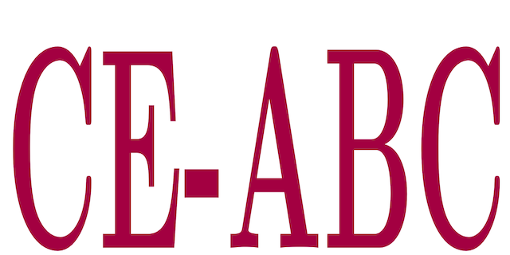

**CE-ABC: Cross-Entropy Approximate Bayesian Computation** is a Matlab package that implements a framework for uncertainty quantification in mechanistic epidemic models defined by ordinary differential equations, which combines the cross-entropy method for optimization and approximate Bayesian computation for statistical inference. With some straightforward adaptations, CE-ABC strategy can also be applied to other systems (mechanical, electrical, coupled, etc). More details are in the following paper:
- *A. Cunha Jr, D. A. W. Barton, and T. G. Ritto, Uncertainty quantification in mechanistic epidemic models via cross-entropy approximate Bayesian computation, Nonlinear Dynamics, in press, 2023 https://doi.org/10.1007/s11071-023-08327-8*

Preprint available at:
https://arxiv.org/abs/2207.12111

## Reproducibility

Simulations done with **CE-ABC** are fully reproducible, as can be seen on this <a href="https://codeocean.com/capsule/5200426/tree/v2" target="_blank">CodeOcean capsule</a>.

## Authors
- Americo Cunha Jr
- David A. W. Barton
- Thiago G. Ritto

## Citing this study
We ask the code users to cite the following manuscript in any publications reporting work done with our code:
- *A. Cunha Jr, D. A. W. Barton, and T. G. Ritto, Uncertainty quantification in mechanistic epidemic models via cross-entropy approximate Bayesian computation, Nonlinear Dynamics, in press, 2023 https://doi.org/10.1007/s11071-023-08327-8*

```
@article{CunhaJr2023p,
   author  = {A {Cunha~Jr} and D. A. W. Barton and T. G. Ritto},
   title   = {Uncertainty quantification in mechanistic epidemic models via cross-entropy approximate Bayesian computation},
   journal = {Nonlinear Dynamics},
   year    = {2023},
   volume  = {~},
   pages   = {in press},
   doi    = {10.1007/s11071-023-08327-8},
}
```

## License
**CE-ABC** is released under the MIT license. See the LICENSE file for details. All new contributions must be made under the MIT license.

 

## Institutional support

 &nbsp; &nbsp;  &nbsp; &nbsp; 

## Funding

 &nbsp; &nbsp;   &nbsp; &nbsp; &nbsp;  &nbsp; &nbsp; &nbsp; 
